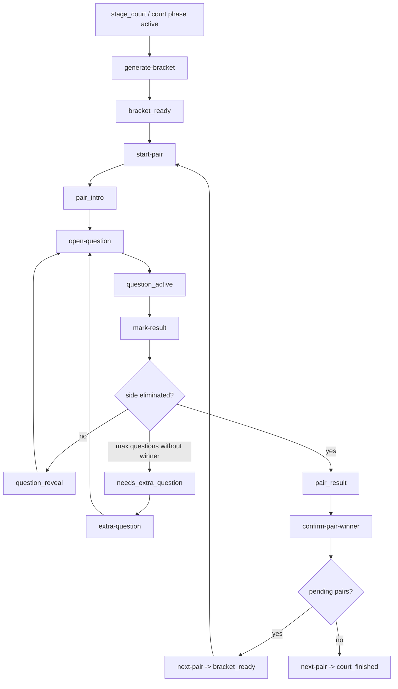

# Court Readiness Audit

## Status

Court is ready for focused command-level smoke coverage.

Recommended first boundary: open Court, generate bracket, finish one deterministic pair, reach `court_finished`, and stop there. A separate transition smoke may verify scenario advance after `court_finished`, but it should stop before starting the next stage and must not enter Final or Terminal.

## Files Inspected

- `docs/COURT_MVP_STABILIZATION_REPORT.md`
- `docs/FULL_SCENARIO_REHEARSAL_REPORT.md`
- `docs/LIVE_DRY_RUN_SCRIPT.md`
- `docs/PRE_LIVE_OPERATOR_CHECKLIST.md`
- `app/services/court_service.py`
- `app/services/scenario_service.py`
- `app/routes/dev.py`
- `app/services/master_state_service.py`
- `app/templates/master_screen.html`
- `app/templates/tv_mode_tv_state.html`

## Source Of Truth

Court runtime state lives in `GamePhase`:

- `phase_type = "court"`
- `status = "active"`
- `payload.source = "court_mvp"`
- `payload.round_code = "stage_court"`

The main runtime implementation is `app/services/court_service.py`.

Master and TV state are derived from the Court runtime through `app/services/master_state_service.py`, using `get_court_runtime_logic`, `build_court_runtime_view_logic`, and `_enrich_court_runtime_payload`.

State GET calls are intended to be read-only. Court sync is explicitly kept behind POST actions, which makes Court suitable for smoke checks that assert GET state calls do not mutate runtime.

## Bracket Generation

The bracket is generated by:

- `POST /dev/court/generate-bracket/{room_code}`
- `generate_court_bracket_logic`

Houses are ranked by:

- higher `resource_influence`
- higher `resource_gold`
- lower house id as deterministic tie-breaker

The bracket pairs ranked houses around the middle. With an odd number of houses, the top ranked house receives a bye. Existing scenario payload metadata is preserved during bracket generation, which avoids the previous `scenario_round_id` loss regression.

## Lifecycle Diagram

## Runtime Endpoints

Primary Court endpoints:

- `GET /dev/court/state/{room_code}`
- `POST /dev/court/generate-bracket/{room_code}`
- `POST /dev/court/start-pair/{room_code}`
- `POST /dev/court/open-question/{room_code}`
- `POST /dev/court/mark-result/{room_code}`
- `POST /dev/court/extra-question/{room_code}`
- `POST /dev/court/confirm-pair-winner/{room_code}`
- `POST /dev/court/next-pair/{room_code}`

Scenario endpoints relevant to Court:

- `POST /dev/games/{room_code}/scenario/start-next-round`
- `POST /dev/games/{room_code}/scenario/advance`

State endpoints relevant to smoke assertions:

- `GET /dev/game-master/{room_code}/state`
- `GET /dev/game-master/{room_code}/tv-state`

## Scenario Director Guard

`app/services/scenario_service.py` maps `stage_court` to Court runtime.

While Court is active and not `court_finished`, normal scenario advance is guarded. `advance_scenario_logic` returns a blocked response with `needs_confirmation = true` unless force advance is explicitly requested.

This guard is important and safe to test before finishing Court. The first smoke should not use force advance.

After `court_finished`, scenario advance can close the Court stage and move to the next configured stage. Older docs mention `stage_final_show`, but the current live scenario now includes the Last Whisper bridge, so the smoke should read the expected next stage from current scenario state instead of hardcoding an old post-Court stage name.

## Safe Smoke Boundary

Minimum safe boundary:

1. Reset runtime.
2. Apply `season1_mvp_live_v2`.
3. Seed technical run.
4. Open or reach `stage_court`.
5. Generate bracket.
6. Start the first pair.
7. Open and resolve questions until one side is eliminated.
8. Confirm pair winner.
9. Move to next pair.
10. Stop when Court reaches `court_finished`.
11. Verify Master and TV state remain fetchable and expose Court completion.

This boundary verifies the Court lifecycle without touching Final or Terminal.

## Proposed First Smoke Plan

Use a small technical run with two houses if available. That creates one Court pair and keeps the smoke deterministic.

Suggested command-level flow:

1. Reset runtime through existing dev helper.
2. Apply `season1_mvp_live_v2`.
3. Seed the technical run.
4. Start or open Court through existing scenario/dev route.
5. Fetch Court state and assert active Court payload exists.
6. Generate bracket and assert one pending pair exists.
7. Start pair and assert `pair_intro`.
8. Open question and assert `question_active`.
9. Mark the same losing side four times through explicit POST calls.
10. Assert current pair reaches `pair_result`.
11. Confirm the winner.
12. Call next pair.
13. Assert Court status is `court_finished`.
14. Fetch Master state and TV state.
15. Assert state fetches do not mutate Court status.

Useful guard checks:

- Scenario advance before `court_finished` should be blocked without force.
- `next-pair` before winner confirmation should fail safely.
- Re-marking a closed question should fail safely or be idempotently rejected.

## What Can Be Verified Without Final Or Terminal

- Bracket generation.
- Current pair selection.
- Court question opening.
- Court result marking.
- Alive-count reduction.
- Pair winner confirmation.
- Court completion.
- Master state visibility.
- TV state visibility.
- Scenario advance guard while Court is unfinished.
- GET state read-only behavior.

## Unsafe Or Deferred Paths

Do not include these in the first Court smoke:

- Full 8-10 house Court traversal.
- Browser UI automation.
- Sudden death and extra-question path.
- Force-advance of unfinished Court.
- Final or Terminal transition.
- Manual winner override as the only path to pair completion.

These are better as separate focused smokes after the baseline lifecycle is covered.

## Risks And Unknowns

- Some older rehearsal docs are stale around post-Court flow because Last Whisper now sits between Court and Final.
- Court statuses are stringly typed, so smoke assertions should prefer current returned state over duplicated constants where possible.
- Question availability depends on imported Court question templates; the baseline smoke should assert no `court_question_bank_exhausted` warning.
- Browser presentation is not covered by a command-level smoke.
- The independent Court smoke may miss a scenario-director integration issue if it opens Court directly instead of reaching it through scenario flow.

## Recommendation

Create `scripts/smoke_court_lifecycle.py` next.

The first smoke should be command-level, deterministic, and stop at `court_finished`. If it also checks scenario behavior, it should only verify that normal advance is blocked before Court completion and optionally that advance is allowed after `court_finished`, without starting Final or Terminal.
