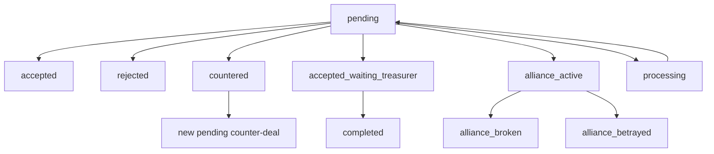

# Diplomacy Runtime Audit

Project: `D:\Projects\pristolov_mvp`  
Date: 2026-05-31  
Scope: diplomacy runtime, alliance storage, player diplomacy routes, Master/TV/player visibility, and next Diplomat action candidates.

## Findings

The current diplomacy runtime already has a usable source of truth: `GameDeal`.

Alliances are not a separate model. An active alliance is represented as a `GameDeal` where:

- `status == "alliance_active"`
- `offer.type == "alliance"`
- the pair is `from_house_id` / `to_house_id`

Broken alliances also stay in `GameDeal`:

- `status == "alliance_broken"` for normal breaks
- `status == "alliance_betrayed"` for betrayal-style breaks
- break metadata is stored inside `offer`

This means the safest next diplomacy work should reuse `GameDeal` and the existing `offer` payload instead of creating a new diplomacy table or framework.

## Current Runtime

Important model fields in `app/models/game_deal.py`:

- `game_id`
- `from_house_id`
- `to_house_id`
- `parent_deal_id`
- `status`
- `offer`
- `note`
- `created_at`
- `responded_at`

Current deal types in player-facing diplomacy:

- `resource`
- `crest_piece`
- `open_agreement`
- `alliance`

Current player routes in `app/routes/player.py`:

- `POST /player/deals/create/{player_id}`
- `POST /player/deals/respond/{player_id}`
- `POST /player/deals/treasurer-confirm/{player_id}`
- `POST /player/alliances/break/{player_id}`

Current Last Whisper route that touches alliances:

- `POST /player/last-whisper/action/{player_id}`
- `action_code = break_alliance`
- mutates selected `GameDeal` from `alliance_active` to `alliance_broken`

## Deal Lifecycle

`processing` is used as a temporary guard while a pending deal is claimed for response.

## Visibility

Master state already exposes:

- `deals`
- `alliances`
- `broken_alliances_recent`
- `last_whisper.latest_event`

TV state already exposes:

- `deals.pending`
- `deals.countered`
- `deals.recent_closed`
- `alliances`
- `broken_alliances_recent`
- `last_whisper.latest_event`

Player state already exposes:

- `incoming_deals`
- `treasurer_pending_deals`
- `active_alliances` for Lord/Lady
- `last_whisper.available_alliances` during Last Whisper

## Candidate Action Table

| Candidate action | Can use `GameDeal`? | Needs new model? | Needs new state contract? | Implementation risk | Notes |
|---|---:|---:|---:|---|---|
| `embassy_offer` | Yes | No | Low/minimal | LOW | Best first extension. Can be represented as `open_agreement` with `offer.meta_action = "embassy_offer"`. |
| `trade_contact` | Yes | No | Medium | MEDIUM | Valuable, but should define whether it is only a recorded contact or has resource payoff. |
| `map_route` | Maybe | No | High | HIGH | Avoid first. It touches map/location contracts and can blur with expedition/map logic. |

## Recommendation

Safest next action: `embassy_offer`.

Highest value action: `trade_contact`, once the expected payoff is defined.

Action to avoid for now: `map_route`, because it touches map/location contracts and can easily become a larger system change.

Recommended next sprint:

1. Add a minimal `embassy_offer` payload contract on top of `open_agreement`.
2. Surface it through existing player deal creation UI.
3. Keep Master/TV visibility on existing `deals` feed.
4. Add a focused command-level smoke for create/respond/visibility.

## Risks

- Deal status values are stringly typed.
- `offer` JSON is flexible but not schema-enforced.
- Some old service strings still contain legacy encoding noise.
- Diplomacy has no dedicated smoke coverage comparable to Last Whisper yet.
- Avoid using dev-only diplomacy helpers as the source of truth for player-facing runtime.
